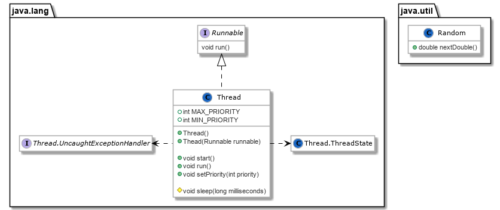

# [Paradigmas de Programação 2020/2021](https://elearning.ual.pt/course/view.php?id=1946), [UAL](https://autonoma.pt/)

## Laboratório 2: Programação concorrente

Este laboratório propõe exercícios focados em programação concorrente.

### Contexto
O mecanismo disponível para suportar concorrência em Java está disponível no *package* `java.lang`, através da classe `Thread`, e interface `Runnable`.

Neste laboratório também será utilizada a classe `java.util.Random`.

O seguinte diagrama mostra uma versão simplificada destes instrumentos.



A utilização da classe `Thread` como classe base, ou implementação de `Runnable` depende das caraterísticas da aplicação (ver mais no [material de apoio às aulas teóricas](https://elearning.ual.pt/mod/page/view.php?id=61575)).

### Documentação JDK 11 relevante
Documentação [`java.lang.Thread`](https://docs.oracle.com/en/java/javase/11/docs/api/java.base/java/lang/Thread.html)

Documentação [`java.util.Random`](https://docs.oracle.com/en/java/javase/11/docs/api/java.base/java/util/Random.html)


## Tarefas

### Tarefa 1
Considere um programa que responde a pedidos `ping` do utilizador com a expressão `pong`. Cada `pong` demora 1 segundo a ser respondido (utilize `Thread.sleep()` para esta restrição).

a)

Implemente um programa não concorrente considerando o seguinte cliente de linha de comandos:

- `ping`: aguarda um segundo, e responde `pong`
- `quit`: termina o programa

b)

Adicione suporte à concorrência recorrendo a `Thread` e/ou `Runnable`.

Cada pedido `ping` deve implicar a construção de uma nova *thread*.

### Tarefa 2
Considere um supermercado com três caixas de pagamento:

- A caixa 1 recebe um cliente em intervalos de tempo entre 1 e 5 segundos
- A caixa 2 recebe clientes em intervalos de tempo entre 3 e 8 segundos
- A caixa 3 recebe clientes em intervalos de tempo entre 2 e 7 segundos

a)

Construa uma aplicação *não concorrente* que simule a chegada de clientes às três caixas, recorrendo a `Thread.sleep()` e a [`java.util.Random()`](https://docs.oracle.com/en/java/javase/11/docs/api/java.base/java/util/Random.html) para modelar os vários tempos de chegada.

Quais os problemas causados pela falta de concorrência?

b)

Adicione suporte à concorrência recorrendo a `Thread` e/ou `Runnable`.

### Tarefa 3
Construa uma aplicação que inicia contadores de tempo concorrentes, cada um parametrizável pelo utilizador.

Cada contador imprime uma mensagem quando chegar a zero. A aplicação termina quando todos os contadores terminarem, e deve demorar o tempo definido para o maior contador.

#### Exemplo de utilização

*Input:*
```shell
SC 10
SC 5
SC 2
START
```

*Output:*
```shell
2 second timer done.
5 second timer done.
10 second timer done.
END
```

### Tarefa 4
Sabemos que o valor de $\pi$ (apox. $ 3.14159 $) representa a razão entre o perímetro de um círculo e o seu raio.

Considere a seguinte estratégia para calcular o valor de $\pi$:

- Assuma um círculo de raio 1 inscrito num quadrado de lado 2
- Escolha $n$ pontos aleatórios dentro do quadrado
  - Alguns pontos irão cair dentro do círculo ($D$), e outros fora ($F$)
- O valor de $\pi$ será determinado por $\frac{D}{D+F}$

a)

Implemente o algoritmo, recorrendo a `java.util.Random` para gerar os valores aleatórios.

Esta geração pode ocorrer apenas no quarto de *círculo inferior*, ficando $\pi = 4 \times \frac{D}{D+F}$.

b)

Construa uma classe que estende `Thread`, e implemente um programa que executa cinco *threads* concorrentes, que calculam o valor de $\pi$ com o mesmo número de iterações.

O programa mostra o resultado de cada cálculo quando cada um termina.

Exemplo de output:

```shell
3.1624
3.1372
3.1412
3.1516
3.136
```

c) Altere a implementação anterior para implementações de `Runnable`, no lugar de extensões de `Thread`.

### Tarefa 5
Considere uma classe `Container` com um atributo onde é registado um valor numérico.

O valor inicial contido num objeto `Container` é zero.

O método `getValue()` de `Container` espera entre 0 e 0.1 segundos antes de responder (utilize `Thread.sleep()`).

Considere a class `ContainerManager` que estende `java.lang.Thread`, e recebe um `Container` na construção.

O método `run()` de `ContainerManager` efetua 100 leituras do valor de `Container` e, após cada leitura, altera o valor para o valor atual + 1.


Teste o programa com 5 *threads* `ContainerManager` concorrentes.

A execução do programa é consistente? Proponha uma solução para eventuais problemas de acesso concorrente.
